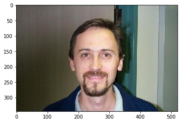
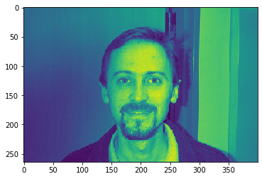
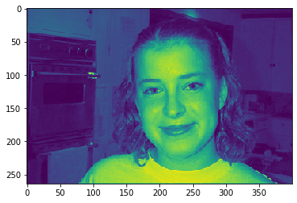
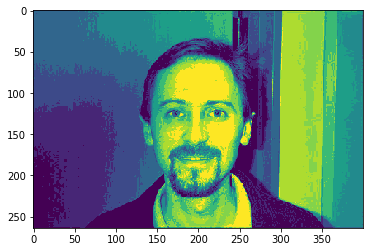
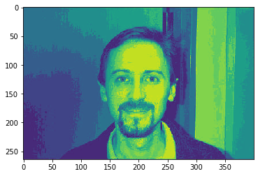

# Image Datasets
Image datasets in this context are directories of files. Kaishi has a lot of built in functionality for interacting with them. While kaishi has many built-in pipeline components that operate on image datasets, a lot of the standard ETL is handled for you in the event you want to add your own custom code (without the ETL hassle).

## Initializing datasets
Let's start by downloading a sample dataset to work with. You will need wget installed unless using your own directory of files.


```python
import wget
import pickle
from PIL import Image
import tarfile
import os

wget.download("http://www.vision.caltech.edu/Image_Datasets/Caltech101/101_ObjectCategories.tar.gz")
tarfile.open("101_ObjectCategories.tar.gz").extractall()
os.remove("101_ObjectCategories.tar.gz")
```

First, initialize a kaishi image dataset object and print a descriptive report of files.


```python
from kaishi.image.dataset import ImageDataset
imd = ImageDataset("101_objectCategories", recursive=True)
imd.file_report()
```

    Current file list:
    +-------+--------------------------+---------------------------------------+--------+
    | Index |        File Name         | Children                              | Labels |
    +-------+--------------------------+---------------------------------------+--------+
    |   0   |  gerenuk/image_0032.jpg  |     {'duplicates': [], 'similar': []} |   []   |
    |   1   |  gerenuk/image_0026.jpg  |     {'duplicates': [], 'similar': []} |   []   |
    |   2   |  gerenuk/image_0027.jpg  |     {'duplicates': [], 'similar': []} |   []   |
    |   3   |  gerenuk/image_0033.jpg  |     {'duplicates': [], 'similar': []} |   []   |
    |   4   |  gerenuk/image_0019.jpg  |     {'duplicates': [], 'similar': []} |   []   |
    |   5   |  gerenuk/image_0025.jpg  |     {'duplicates': [], 'similar': []} |   []   |
    |   6   |  gerenuk/image_0031.jpg  |     {'duplicates': [], 'similar': []} |   []   |
    |   7   |  gerenuk/image_0030.jpg  |     {'duplicates': [], 'similar': []} |   []   |
    |  ...  |                          |                                       |        |
    |  9137 | metronome/image_0015.jpg |     {'duplicates': [], 'similar': []} |   []   |
    |  9138 | metronome/image_0029.jpg |     {'duplicates': [], 'similar': []} |   []   |
    |  9139 | metronome/image_0028.jpg |     {'duplicates': [], 'similar': []} |   []   |
    |  9140 | metronome/image_0014.jpg |     {'duplicates': [], 'similar': []} |   []   |
    |  9141 | metronome/image_0016.jpg |     {'duplicates': [], 'similar': []} |   []   |
    |  9142 | metronome/image_0002.jpg |     {'duplicates': [], 'similar': []} |   []   |
    |  9143 | metronome/image_0003.jpg |     {'duplicates': [], 'similar': []} |   []   |
    |  9144 | metronome/image_0017.jpg |     {'duplicates': [], 'similar': []} |   []   |
    +-------+--------------------------+---------------------------------------+--------+
    Filtered files:
    +-----------+---------------+
    | File Name | Filter Reason |
    +-----------+---------------+
    +-----------+---------------+


    /Users/mwharton/.miniconda3/envs/kaishi/lib/python3.7/site-packages/kaishi/image/dataset.py:20: UserWarning: No GPU detected, ConvNet prediction tasks will be very slow
      warnings.warn("No GPU detected, ConvNet prediction tasks will be very slow")


There are almost 10k images in this directory, let's use a subdirectory to keep the dataset small.


```python
imd = ImageDataset("101_objectCategories/Faces")
imd.file_report()
```

    Current file list:
    +-------+----------------+---------------------------------------+--------+
    | Index |   File Name    | Children                              | Labels |
    +-------+----------------+---------------------------------------+--------+
    |   0   | image_0146.jpg |     {'duplicates': [], 'similar': []} |   []   |
    |   1   | image_0152.jpg |     {'duplicates': [], 'similar': []} |   []   |
    |   2   | image_0185.jpg |     {'duplicates': [], 'similar': []} |   []   |
    |   3   | image_0191.jpg |     {'duplicates': [], 'similar': []} |   []   |
    |   4   | image_0378.jpg |     {'duplicates': [], 'similar': []} |   []   |
    |   5   | image_0344.jpg |     {'duplicates': [], 'similar': []} |   []   |
    |   6   | image_0422.jpg |     {'duplicates': [], 'similar': []} |   []   |
    |   7   | image_0350.jpg |     {'duplicates': [], 'similar': []} |   []   |
    |  ...  |                |                                       |        |
    |  427  | image_0349.jpg |     {'duplicates': [], 'similar': []} |   []   |
    |  428  | image_0375.jpg |     {'duplicates': [], 'similar': []} |   []   |
    |  429  | image_0413.jpg |     {'duplicates': [], 'similar': []} |   []   |
    |  430  | image_0407.jpg |     {'duplicates': [], 'similar': []} |   []   |
    |  431  | image_0361.jpg |     {'duplicates': [], 'similar': []} |   []   |
    |  432  | image_0188.jpg |     {'duplicates': [], 'similar': []} |   []   |
    |  433  | image_0177.jpg |     {'duplicates': [], 'similar': []} |   []   |
    |  434  | image_0163.jpg |     {'duplicates': [], 'similar': []} |   []   |
    +-------+----------------+---------------------------------------+--------+
    Filtered files:
    +-----------+---------------+
    | File Name | Filter Reason |
    +-----------+---------------+
    +-----------+---------------+


## Interaction with datasets
Now, let's look at a couple ways to access the images.

Each of these "files" are actually kaishi.image.file.File objects, which have quite a few interesting methods to enable rapid analysis. Each image object is initialized to None by default, but verify_loaded() will load an individual file, whereas load_all() will load all of them. If running a pipeline, load_all() will be called for you.


```python
imd.files[:10]
```


    [image_0146.jpg,
     image_0152.jpg,
     image_0185.jpg,
     image_0191.jpg,
     image_0378.jpg,
     image_0344.jpg,
     image_0422.jpg,
     image_0350.jpg,
     image_0387.jpg,
     image_0393.jpg]


```python
print(imd.files[0].image is None)
imd.files[0].verify_loaded()
print(imd.files[0].image is None)
```

    True
    False


```python
import matplotlib.pyplot as plt
plt.imshow(imd.files[0].image)
plt.show()
plt.imshow(imd["image_0146.jpg"].image)
plt.show()
```





## Image processing pipelines
Let's see the pipeline options.


```python
imd.get_pipeline_options()
```


    ['FilterByLabel',
     'FilterByRegex',
     'FilterDuplicateFiles',
     'FilterInvalidFileExtensions',
     'FilterInvalidImageHeaders',
     'FilterSimilar',
     'FilterSubsample',
     'LabelerGenericConvnet',
     'LabelerValidationAndTest',
     'TransformFixRotation',
     'TransformLimitDimensions',
     'TransformToGrayscale']


Now we can create, configure, and run a pipeline.

Note: the default regex pattern does not perform any filtering.


```python
imd.configure_pipeline(["FilterInvalidImageHeaders", "FilterDuplicateFiles", "FilterByRegex", "TransformLimitDimensions", "TransformToGrayscale"])
print(imd.pipeline)
```

    Kaishi pipeline: 
    0: FilterInvalidImageHeaders
    1: FilterDuplicateFiles
    2: FilterByRegex
         pattern: '/(?=a)b/'
    3: TransformLimitDimensions
         max_dimension: None
         max_width: None
         max_height: None
    4: TransformToGrayscale
    


```python
imd.pipeline.components[2].configure(pattern="image_02.*jpg")
imd.pipeline.components[3].configure(max_dimension=400)
print(imd.pipeline)
```

    Kaishi pipeline: 
    0: FilterInvalidImageHeaders
    1: FilterDuplicateFiles
    2: FilterByRegex
         pattern: 'image_02.*jpg'
    3: TransformLimitDimensions
         max_dimension: 400
         max_width: None
         max_height: None
    4: TransformToGrayscale
    


```python
imd.run_pipeline()
```

Now we can analyze the results.


```python
imd.file_report()
```

    Current file list:
    +-------+----------------+---------------------------------------+---------------+
    | Index |   File Name    | Children                              |     Labels    |
    +-------+----------------+---------------------------------------+---------------+
    |   0   | image_0146.jpg |     {'duplicates': [], 'similar': []} | ['GRAYSCALE'] |
    |   1   | image_0152.jpg |     {'duplicates': [], 'similar': []} | ['GRAYSCALE'] |
    |   2   | image_0185.jpg |     {'duplicates': [], 'similar': []} | ['GRAYSCALE'] |
    |   3   | image_0191.jpg |     {'duplicates': [], 'similar': []} | ['GRAYSCALE'] |
    |   4   | image_0378.jpg |     {'duplicates': [], 'similar': []} | ['GRAYSCALE'] |
    |   5   | image_0344.jpg |     {'duplicates': [], 'similar': []} | ['GRAYSCALE'] |
    |   6   | image_0422.jpg |     {'duplicates': [], 'similar': []} | ['GRAYSCALE'] |
    |   7   | image_0350.jpg |     {'duplicates': [], 'similar': []} | ['GRAYSCALE'] |
    |  ...  |                |                                       |               |
    |  327  | image_0349.jpg |     {'duplicates': [], 'similar': []} | ['GRAYSCALE'] |
    |  328  | image_0375.jpg |     {'duplicates': [], 'similar': []} | ['GRAYSCALE'] |
    |  329  | image_0413.jpg |     {'duplicates': [], 'similar': []} | ['GRAYSCALE'] |
    |  330  | image_0407.jpg |     {'duplicates': [], 'similar': []} | ['GRAYSCALE'] |
    |  331  | image_0361.jpg |     {'duplicates': [], 'similar': []} | ['GRAYSCALE'] |
    |  332  | image_0188.jpg |     {'duplicates': [], 'similar': []} | ['GRAYSCALE'] |
    |  333  | image_0177.jpg |     {'duplicates': [], 'similar': []} | ['GRAYSCALE'] |
    |  334  | image_0163.jpg |     {'duplicates': [], 'similar': []} | ['GRAYSCALE'] |
    +-------+----------------+---------------------------------------+---------------+
    Filtered files:
    +----------------+---------------+
    |   File Name    | Filter Reason |
    +----------------+---------------+
    | image_0215.jpg |     regex     |
    | image_0201.jpg |     regex     |
    | image_0229.jpg |     regex     |
    | image_0228.jpg |     regex     |
    | image_0200.jpg |     regex     |
    |      ...       |               |
    | image_0231.jpg |     regex     |
    | image_0225.jpg |     regex     |
    | image_0224.jpg |     regex     |
    | image_0230.jpg |     regex     |
    | image_0218.jpg |     regex     |
    +----------------+---------------+


Note that the images have been sized down (max dimension is 400) and are now grayscale (as expected)


```python
plt.imshow(imd["image_0146.jpg"].image)
plt.show()
plt.imshow(imd["image_0361.jpg"].image)
plt.show()
```








## Custom pipeline components
What if we wanted to create a custom pipeline component?

Let's create one that quantizes each of the images that passed our previous filter operations.


```python
from kaishi.core.pipeline_component import PipelineComponent

# Follow rules specified in the pipeline comonent guide
class TransformByQuantizing(PipelineComponent):
    """Transform that quantizes images."""

    def __init__(self):
        super().__init__()
        self.configure()
        self.applies_to_available = True  # Set this to true if using the "get_target_indexes" method

    def __call__(self, dataset):
        # Trim any files without image extensions
        for i in self.get_target_indexes(dataset):
            dataset.files[i].image = dataset.files[i].image.quantize(colors=self.n_colors).convert("L")
            dataset.files[i].update_derived_images()  # This updates thumbnails/etc.
    
    def configure(self, n_colors=32):
        self.n_colors = n_colors
        
imd.TransformByQuantizing = TransformByQuantizing
```

Check to see that it was properly added


```python
imd.get_pipeline_options()
```


    ['FilterByLabel',
     'FilterByRegex',
     'FilterDuplicateFiles',
     'FilterInvalidFileExtensions',
     'FilterInvalidImageHeaders',
     'FilterSimilar',
     'FilterSubsample',
     'LabelerGenericConvnet',
     'LabelerValidationAndTest',
     'TransformByQuantizing',
     'TransformFixRotation',
     'TransformLimitDimensions',
     'TransformToGrayscale']


```python
imd.configure_pipeline(["TransformByQuantizing"])
print(imd.pipeline)
```

    Kaishi pipeline: 
    0: TransformByQuantizing
         n_colors: 32
    


```python
imd.pipeline.components[0].configure(n_colors=10)
imd.pipeline.components[0].applies_to("image_01.*jpg")
print(imd.pipeline)
imd.run_pipeline()
```

    Kaishi pipeline: 
    0: TransformByQuantizing
         n_colors: 10
    


As expected, any image with the pattern image_01... is quantized (most notable in the background) whereas any image not matching this pattern remained intact.


```python
plt.imshow(imd["image_0146.jpg"].image)
plt.show()
plt.imshow(imd["image_0361.jpg"].image)
plt.show()
```





## Saving
Finally, we can save the edited dataset


```python
imd.save("Faces_edited")
```


```python
imd_edited = ImageDataset("Faces_edited")
imd_edited.load_all()
```

    /Users/mwharton/.miniconda3/envs/kaishi/lib/python3.7/site-packages/kaishi/image/dataset.py:20: UserWarning: No GPU detected, ConvNet prediction tasks will be very slow
      warnings.warn("No GPU detected, ConvNet prediction tasks will be very slow")


```python
plt.imshow(imd_edited["image_0146.jpg"].image)
plt.show()
plt.imshow(imd_edited["image_0361.jpg"].image)
plt.show()
```





